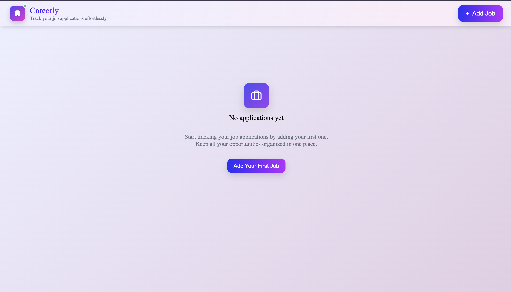
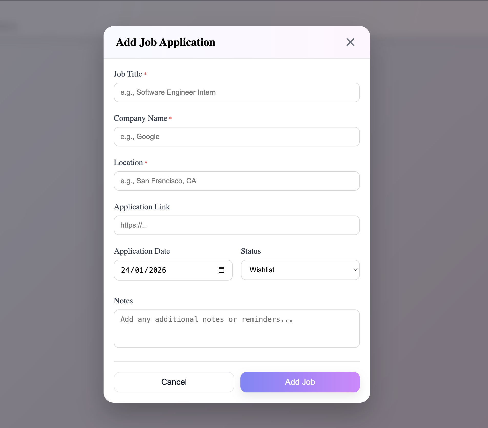
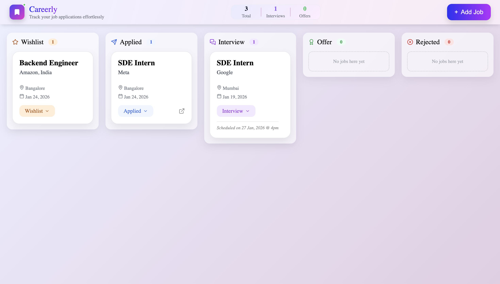

# Careerly – Job Application Tracker

A **frontend-only job application tracker** built with **React**, designed to help users organize and manage their job search through a clean, focused interface.

> ✅ **Version 1 completed**  
> Careerly v1 establishes a solid frontend foundation with clear UX states, reusable components, and essential job-tracking functionality.

---

## 📌 Project Overview

Tracking job applications across multiple platforms can become messy and unstructured.  
**Careerly** solves this by providing a simple interface to add, view, and manage job applications in one place.

Version 1 focuses on **clarity, usability, and clean component design**, without backend complexity.

---

## ✨ Features (v1)

- ➕ Add job applications
- ✏️ Edit existing job details
- 🗑 Delete job applications
- 📊 Track application status  
  *(Saved, Applied, Interview, Offer, Rejected)*
- 📅 Store applied dates
- 📍 Save job locations
- 🔗 External job links
- 🧩 Reusable UI components (Button, Input, Modal)
- 🎯 Clear empty states and user guidance

---

## 🛠 Tech Stack

- **React**
- **JavaScript (ES6+)**
- **CSS** (inline & component-based styling)
- **Lucide React** – icons

---

## 🖼 Screenshots

> UI screens from Careerly v1

```md


